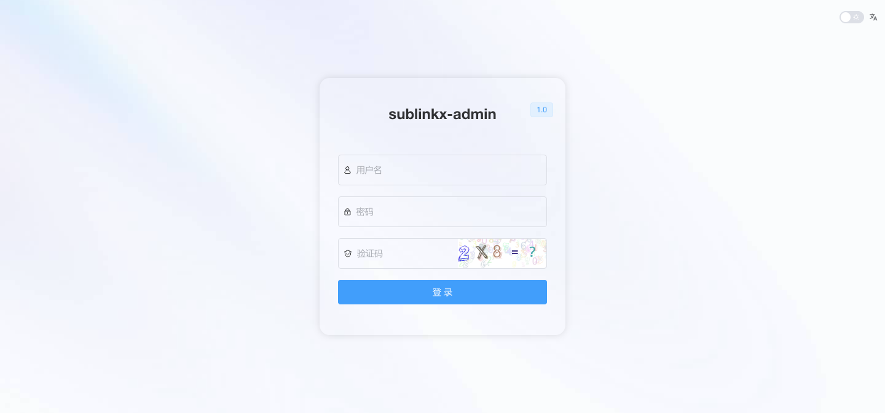
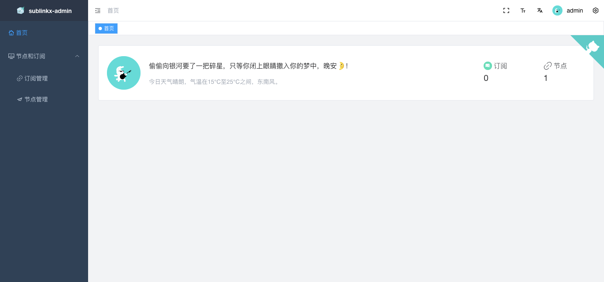

<div align="center">

</div>

<div align="center">
    
    
    
    
    <a href="https://t.me/+u6gLWF0yP5NiZWQ1" target="_blank">
        
    </a>
    <div align="center"> 中文 | <a href="README.en-US.md">English</div>
</div>

## [项目简介]

项目基于sublink项目二次开发：https://github.com/jaaksii/sublink

前端基于：https://github.com/youlaitech/vue3-element-admin

后端采用go+gin+gorm

默认账号admin 密码123456  自行修改

因为重写目前还有很多布局结构以及功能稍少

## [项目特色]

自由度和安全性较高，能够记录访问订阅，配置轻松

二进制编译无需Docker容器

目前仅支持客户端：v2ray clash surge

v2ray为base64通用格式

clash支持协议:ss ssr trojan vmess vless hy hy2 tuic

surge支持协议:ss trojan vmess hy2 tuic

## [项目预览]




## [2.1更新说明]

#### 后端更新

1. 修复底层代码
2. 修复各种奇葩bug
3. 建议卸载数据库(记得备份数据) 新数据库结构有些不一样可能会导致一些bug

#### 前端更新

1. 完善node页面


## [安装说明]
### linux方式：
```
curl -s -H "Cache-Control: no-cache" -H "Pragma: no-cache" https://raw.githubusercontent.com/gooaclok819/sublinkX/main/install.sh | sudo bash
```

```sublink``` 呼出菜单

然后输入安装脚本即可

### docker方式：

在自己需要的位置创建一个目录比如mkdir sublinkx

然后cd进入这个目录，输入下面指令之后数据就挂载过来

需要备份的就是db和template
```
docker run --name sublinkx -p 8000:8000 \
-v $PWD/db:/app/db \
-v $PWD/template:/app/template \
-v $PWD/logs:/app/logs \
-d jaaksi/sublinkx
```

To support the development of my project, I plan to apply for a free VPS offered by ZMTO. My project currently involves Docker image support for multiple architectures (arm64 and amd64), as well as automation for building and pushing. Therefore, I am requesting a 4-core, 8GB RAM Ubuntu VPS with root access.

Thank you to the ZMTO team for your support. I look forward to leveraging this VPS to optimize my project's performance and development efficiency. If you have any questions or suggestions regarding my project, feel free to open an issue, and I will do my best to improve and optimize it.

Thank you for your attention and support!

Feel free to adjust any details as needed!

## Stargazers over time
[](https://starchart.cc/gooaclok819/sublinkX)

